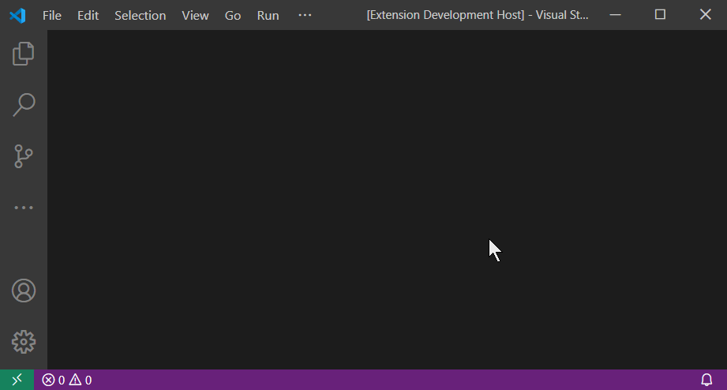
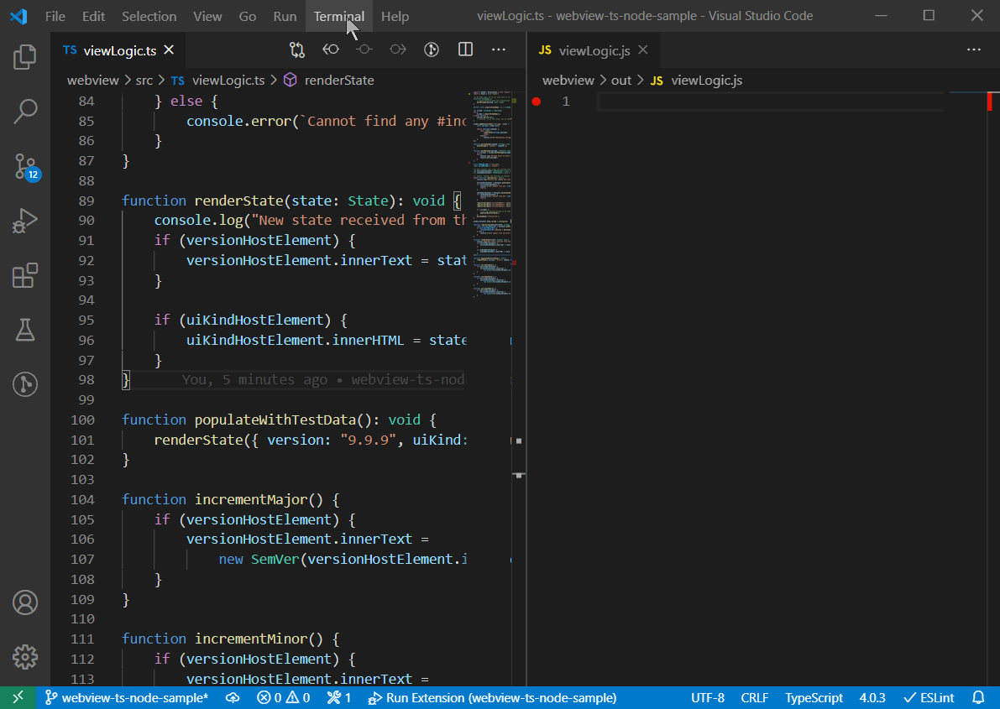
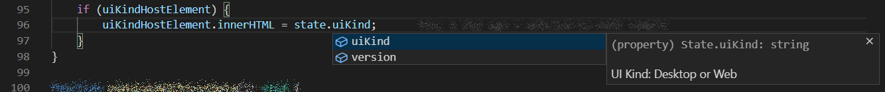

# Webview semver calculator - develop and debug view logic using Typescript and Node

Demonstrates VS Code's [webview API](https://code.visualstudio.com/api/extension-guides/webview)
with a typescript and node based view logic. This is useful for those that implement more complex Webviews.
The more code you add to tye Webview view logic, the more you benefit from the full power of the Typescript syntactic checking.
Moreover, once the Webview view logic is built using NPM, it is easy to include any of the Node packages e.g.
data visualization packages. The structure of the sample also enables debugging of the Webview view logic.

This sample demonstrates includes:

- Creating and showing a basic webview.
- Using an NPM package in the webview view logic.
- Simpler authoring of the HTML and CSS styles and quick preview.
- Faster turn around view logic testing workflow using the [Debugger for Chrome extension](https://marketplace.visualstudio.com/items?itemName=msjsdiag.debugger-for-chrome)
- Type-safe data exchange between the extension and the webview view logic (see the `State` class)

## Demo



The webview view logic takes advantage of full syntactic validation, because it is written in Typescript.
This way you can also use your favorite Node modules inside the webview. The sample shows that using the `semver` module.

## VS Code API

### `vscode` module

- [`window.createWebviewPanel`](https://code.visualstudio.com/api/references/vscode-api#window.createWebviewPanel)

## Running the example

### Running in VS Code

- Open this example in VS Code 1.47+
- `npm install`
- `npm run watch` or `npm run compile`
- `F5` to start debugging using the _Run Extension_ launch configuration

Run the `Webview semver calculator: Start Webview semver calculator session` to create the webview.

### Debugging view logic in Chrome

It is also possible to launch and debug just the HTML+CSS+JS part of the Webview (without having to start VS Code):

- `npm run watch` in the `webview` directory (also conveniently configured in `tasks.json`)
- select `F5` to start debugging using the _Preview view.html_
- set breakpoints either in the Chrome debugger, or into the `viewLogic.js` in VS Code



## Developing your own webview from this sample

The webview HTML content is on purpose saved into `view.html` file as a template, so the file may be open in a web browser
or any HTML editor for quick and convenient evolution. It is placed into the `webview/out` folder, where Browserify outputs
the transpiled view logic into a Javascript file `viewLogic.js`. Therefore it is necessary to run `npm run compile`
in the `webview` folder (or on the top folder) before the `view.html` works. To keep the generated Javascript up to date with your
Typescript changes in `viewLogic.ts`, keep the `npm run watch` task form the `webview/package.json` running.

Read more about the [browserify, watchify and tsify](https://www.npmjs.com/package/tsify#watchify).

Furthermore, minification and uglyfication plugins may be added to the `webview/package.json` to create smaller extension packages
and faster Webview start-up times.

Last, but not least, with NPM used to transpile the view logic, you are one step closer to creating unit test coverage
and including it into your extension's `npm test`.

## Advanced topics

### Unit-testing the view logic (optional)

The sample also demonstrate, how the view logic may be unit-tested using [mocha](https://www.npmjs.com/package/mocha)
and [chai](https://www.npmjs.com/package/chai). This is, of course, optional, but saves time during the development cycle.
These are the elements:

The `webview/package.json` should include following packages in the `devDependencies` section:

```json
  "devDependencies": {
    "@types/mocha": "^7.0.2",
    "mocha": "^7.1.0",
    "@types/chai": "4.1.3",
    "chai": "^4.2.0",
    // ...
  }
```

Optionally, the top level `package.json` should include the `nyc` in `devDependencies`, if you want to use the VS Code Mocha sidebar extension to run the tests.

The `webview/tsconfig.json` needs to be modified this way:

```json
  "compilerOptions": {
    "outDir": "out-test",
    "rootDirs": ["src", "test"],
  }
```

That ensures the `test` subfolder is also transpiled prior to running tests.\
The output should be directed to the `out-test` directory, which is created just for the purpose of running tests.

```json
  "scripts": {
    "pretest": "tsc && npm run lint",
    "test-watch": "tsc -w",
    "test": "mocha -- out-test/test/**/*.js",
    // ...
  }
```

Then a unit test file should be added to the `webview/test/` directory containing at least one test:

```typescript
import { expect } from 'chai';
// import a view logic utility (must not depend on the DOM)
import { utility } from '../src/viewLogicUtility';

describe("view logic...", () => {
    it('simple assertion should pass', () => {
        expect(true).to.be.equal(true);
    });
});
```

It may also be useful to run the webview's integration tests in a browser using [babelify](https://medium.com/caffeine-and-testing/testing-es6-modules-with-mocha-using-babel-with-browserify-e6f5514f66d3) or [testling](https://gist.github.com/substack/7480813).

### Sharing common code between extension and webview

One of the usual bugs in extensions with webviews is the misalignment between
the code in the extension and code in the webview. If state is being exchanged
between the extension and the webview, the best way to keep both sides
synchronized is to declare the message schema in one place and share it in both pieces of code.

In this sample, the shared message schema is in the `State` interface placed in the `model` directory in the extension.\
In order for the webview code to be able to import the `State` interface, it is wrapped into a local NPM package named `model`. Following stars must be aligned:

The `tsconfig.json` on the top level should have `declaration` enabled.\
This will create the `.d.ts` files that the webview Typescript code will need.

```json
    "compilerOptions": {
        "declaration": true,
        ...
```

> The definition files should be also removed from the vsce package
> by adding this line to the `.vscodeignore` file: `out/**/*.d.ts`

Next, the simple `package.json` file in the `out/model` directory
provides the minimal description of the package, so it can be referenced
from the `webview/package.json`:

```json
  "devDependencies": {
    "model": "file:../out/model",
```

There is no need to publish such a package to any NPM registry.
It is just referenced using the relative path.

Re-run `npm install`.

Now we have everything in place to import the shared contract:

```typescript
import { State } from "model";
```

And use it with full power of the syntax checking and intellisense.



Similarly, the `Notification.ts` shows how to define a message schema for the Webview to pass type-safe messages back to the extension code.
